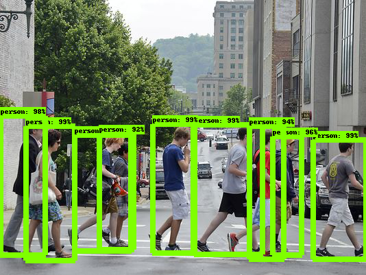

[](https://colab.research.google.com/drive/1dBxAyofXu5xecTDDhX7euqj0QZSFSjl7?usp=sharing)

In this notebook, I'll exemplify how to use the `TFObjectDetector` class built into [dodo_detector](https://douglasrizzo.github.io/dodo_detector/) to detect objects in images. Please note that, for this tutorial, TensorFlow as well as the TensorFlow Object Detection API must be installed and in your `PYTHONPATH`.

Documentation for the `TFObjectDetector` class is available [here](https://douglasrizzo.github.io/dodo_detector/dodo_detector.html#dodo_detector.detection.TFObjectDetector).

First, we'll download a pre-trained model from the [model zoo](https://github.com/tensorflow/models/blob/master/research/object_detection/g3doc/tf1_detection_zoo.md), trained on the COCO data set, as well as the COCO label map and an example image found on the internet.


```python
![ -e faster_rcnn_resnet50_coco_2018_01_28.tar.gz ] || \
    wget http://download.tensorflow.org/models/object_detection/faster_rcnn_resnet50_coco_2018_01_28.tar.gz

![ -e faster_rcnn_resnet50_coco_2018_01_28 ] || \
    tar -xvf faster_rcnn_resnet50_coco_2018_01_28.tar.gz

![ -e ssd_mobilenet_v1_coco_2018_01_28.tar.gz ] || \
    (wget http://download.tensorflow.org/models/object_detection/ssd_mobilenet_v1_coco_2018_01_28.tar.gz && \
    tar -xvf ssd_mobilenet_v1_coco_2018_01_28.tar.gz)

![ -e mscoco_label_map.pbtxt ] || \
    wget https://raw.githubusercontent.com/tensorflow/models/master/research/object_detection/data/mscoco_label_map.pbtxt

![ -e pedestrians01.jpg ] || \
    wget https://www.groundreport.com/wp-content/uploads/2016/05/pedestrians01.jpg
```

Load the packages necessary to read and display images, as well as the detection package


```python
import numpy as np
from PIL import Image
from dodo_detector.detection import TFObjectDetector
```


```python
# load an image as a numpy array
im = np.array(Image.open('pedestrians01.jpg'))
```


```python
# create the detector, pointing to the pre-trained model and the label map
detector = TFObjectDetector('faster_rcnn_resnet50_coco_2018_01_28/frozen_inference_graph.pb', 'mscoco_label_map.pbtxt', 5)

# use the detector to find objects in an image
marked_image, objects = detector.from_image(im)
```


```python
# list objects found. locations are given in tuples in the format (ymin, xmin, ymax, xmax)
objects
```


    {'person': [(204, 456, 377, 534),
      (182, 283, 370, 383),
      (181, 222, 368, 282),
      (184, 37, 379, 109),
      (169, 0, 371, 66),
      (199, 397, 371, 440),
      (197, 108, 365, 191),
      (184, 363, 377, 414),
      (195, 144, 363, 195)]}


```python
Image.fromarray(marked_image)
```



