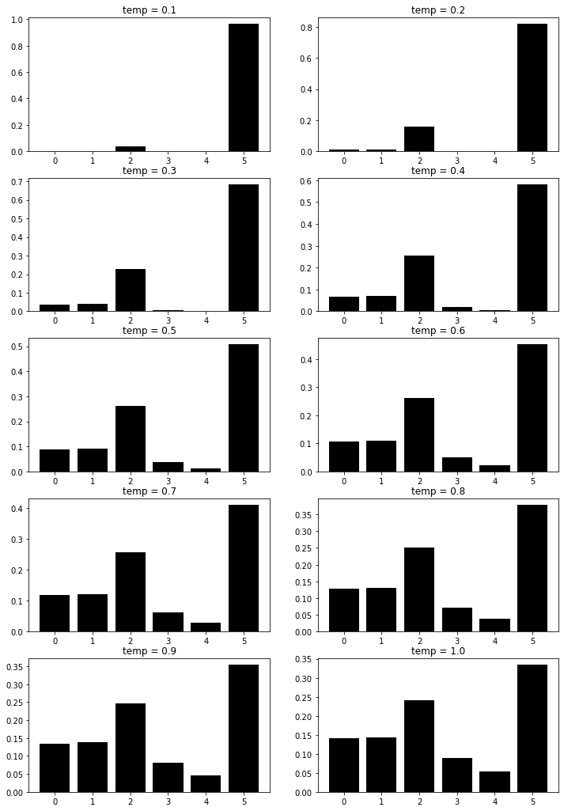

[](https://colab.research.google.com/drive/18PTAJNhem2zwJUZVuktaKkcjmfskET4_?usp=sharing)

The Boltzmann policy normalizes the final Q values using a softmax function and uses the resulting values as probabilities, selecting an action much like a stochastic policy.

$$P(a_i) = \frac{\exp(Q_{a_i})}{\sum_{a \in A} \exp(Q_a)}$$

An additional step is to use a temperature parameter $\tau$ to control the spread of the probabilities between actions.

$$P(a_i) = \frac{\exp(Q_{a_i}/\tau)}{\sum_{a \in A}\exp(Q_a/\tau)}$$

In this notebook, I visualize the effect of different values of $\tau$ in a generated discrete distribution.

```python
%matplotlib inline
import torch
from torch.distributions.normal import Normal
import matplotlib as mpl
import matplotlib.pyplot as plt

mpl.style.use('grayscale')
```

For this test, I'll generate a bunch of Q values from a normal distribution with $\mu=0$ and $\sigma=1$. I'll then use values of $\tau=\{0.1, 0.2, \ldots, 1\}$ to generate the final distributions.

```python
qs=Normal(0, 1).sample((6,))

nrows, ncols = 5, 2

fig, axes = plt.subplots(nrows, ncols, figsize=(12, 18))
temps = torch.linspace(.1, 1, nrows * ncols)

for i in range(nrows):
    for j in range(ncols):
        t_index=i * ncols + j
        t = round(float(temps[t_index]), 1)
        qs_prob=(qs / t).softmax(-1)

        ax=axes[i, j]
        ax.bar(range(qs_prob.shape[0]), qs_prob)
        ax.set_title('temp = {}'.format(t))

```



