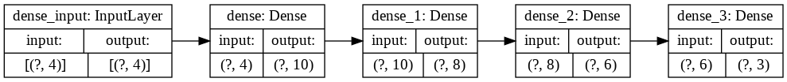
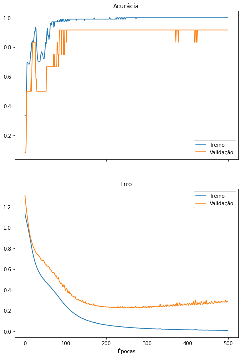
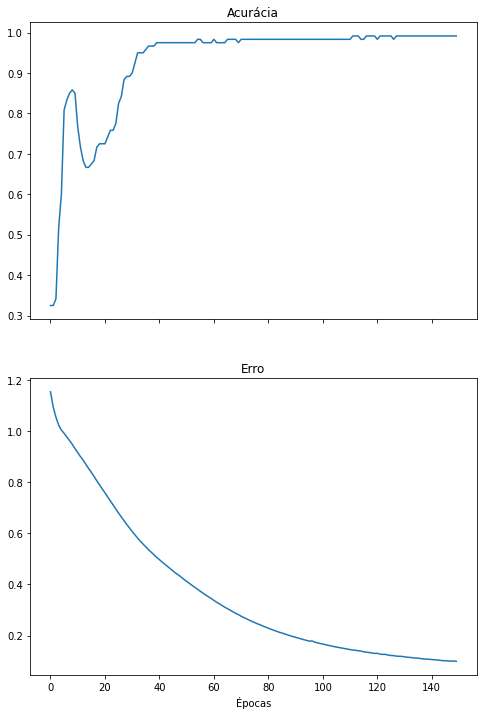

[](https://colab.research.google.com/drive/13r1TY_BF1AXOMH8ufDEct3E8g243sONM?usp=sharing)

Este notebook exemplifica o treinamento de uma perceptron multi-camadas na classificação da base de dados Iris. O notebook utiliza o pacote *scikit-learn* para carregamento e separação da base de dados em treinamento e teste, o pacote *keras* para criação e treinamento da rede neural e o *matplotlib* para a geração de gráficos.

```python
from sklearn.datasets import load_iris
from sklearn.model_selection import train_test_split
from sklearn.metrics import classification_report, confusion_matrix

import matplotlib.pyplot as plt

import tensorflow.keras as keras
import numpy as np
from tensorflow.keras.models import Sequential
from tensorflow.keras.layers import Dense
from tensorflow.keras.optimizers import SGD,Adam
```

## Preparando a base de dados

A base de dados Iris contém 4 medidas de 150 pétalas de flores de 3 espécies distintas (50 pétalas de cada espécie). Ela foi criada em 1936 por Ronald Fisher [[link]](https://en.wikipedia.org/wiki/Iris_flower_data_set).

Neste notebook, uma rede neural será utilizada para descobrir a qual das 3 espécies de flor cada pétala pertence, dadas as 4 medidas da pétala. Em outras palavras, a rede neural será um classificador treinado para prever em qual classe (de 3) um vetor de 4 valores pertence.


Usaremos o pacote *scikit-learn* para carregar a base de dados e separá-la entre conjuntos de treinamento e de teste.


```python
iris_X, iris_y = load_iris(return_X_y=True)
X_train, X_test, y_train, y_test = train_test_split(iris_X,
                                                    iris_y,
                                                    test_size = 0.2,
                                                    random_state=123)

print('Qtd. itens no conj. de treinamento:', len(y_train))
print('Classes:', y_train)
print('\nQtd. itens no conj. de teste:', len(y_test))
print('Classes:', y_test)
print('\nExemplo de medida de uma flor:', X_train[0])
```

    Qtd. itens no conj. de treinamento: 120
    Classes: [2 2 0 0 1 1 2 0 0 1 1 0 2 2 2 2 2 1 0 0 2 0 0 1 1 1 1 2 1 2 0 2 1 0 0 2 1
     2 2 0 1 1 2 0 2 1 1 0 2 2 0 0 1 1 2 0 0 1 0 1 2 0 2 0 0 1 0 0 1 2 1 1 1 0
     0 1 2 0 0 1 1 1 2 1 1 1 2 0 0 1 2 2 2 2 0 1 0 1 1 0 1 2 1 2 2 0 1 0 2 2 1
     1 2 2 1 0 1 1 2 2]
    
    Qtd. itens no conj. de teste: 30
    Classes: [1 2 2 1 0 2 1 0 0 1 2 0 1 2 2 2 0 0 1 0 0 2 0 2 0 0 0 2 2 0]
    
    Exemplo de medida de uma flor: [7.4 2.8 6.1 1.9]


Vamos categorizar as classes de flores (0, 1 e 2) utilizando *one-hot encoding*, uma espécie de categorização de dados que torna o aprendizado de classe linearmente independente para a rede neural.


```python
y_train_onehot = keras.utils.to_categorical(y_train, num_classes = 3)
y_test_onehot = keras.utils.to_categorical(y_test, num_classes = 3)

# imprime os 5 primeiros valores para exemplificar
print("### Antes ###")
print(y_train[:5])
print(y_test[:5])

print("\n### Depois ###")
print(y_train_onehot[:5])
print(y_test_onehot[:5])
```

    ### Antes ###
    [2 2 0 0 1]
    [1 2 2 1 0]
    
    ### Depois ###
    [[0. 0. 1.]
     [0. 0. 1.]
     [1. 0. 0.]
     [1. 0. 0.]
     [0. 1. 0.]]
    [[0. 1. 0.]
     [0. 0. 1.]
     [0. 0. 1.]
     [0. 1. 0.]
     [1. 0. 0.]]


## Declarando a topologia da rede neural

Vamos construir uma rede neural utilizando Keras. Aqui, configuramos camadas, neurônios por camada, funções de ativação, otimizador e função de erro.

Após construir a rede neural, utilizamos uma função utilitária do Keras para exibir a topologia do modelo. Neste caso, a rede receberá como entrada vetores de tamanho 4 (correspondente à quantidade de medidas de nossas pétalas e utilizará 4 camadas densas para realizar a classificação.

Repare que o tamanho da saída de uma camada equivale ao tamanho dos valores de entrada da camada seguinte.

A última camada da rede tem como saída vetores de tamanho 3, correspondentes à quantidade de espécies de flores que desejamos classificar.

Vamos criar uma função para conseguir recriar o mesmo modelo no futuro.


```python
def create_model():
  model = Sequential()
  model.add(Dense(10, activation='tanh', input_dim=4))
  model.add(Dense(8,activation='tanh'))
  model.add(Dense(6,activation='tanh'))
  model.add(Dense(3,activation='softmax'))
  model.compile('adam','categorical_crossentropy', metrics=['categorical_accuracy'])

  return model

model=create_model()

keras.utils.plot_model(
    model,
    show_shapes=True,
    show_layer_names=True,
    rankdir="LR",
    expand_nested=True,
    dpi=96
)
```




## Treinando a rede

Vamos treinar nossa rede neural. Ela aprenderá a realizar a classificação dos dados de treinamento (`X_train`) para as classes categorizadas (`y_train_onehot`) por um número de épocas pré-determinado.

O Keras permite armazenar o progresso do treinamento em uma variável, a qual será utilizada no futuro.

Repare a diminuição da função de erro e aumento da acurácia (porcentagem de classificações corretas durante o treino) ao longo das épocas.

É possível executar a célula abaixo repetidas vezes para que a mesma rede seja treinada por mais épocas.

Também é possível separar uma parcela do conjunto de treinamento para *validação*, a avaliação em tempo real da rede neural em um conjunto de dados o qual não é utilizado para seu treinamento.


```python
# history = model.fit(X_train, y_train_onehot, epochs=500)
history = model.fit(X_train, y_train_onehot, validation_split=.1, epochs=500)
```

    Epoch 1/500
    4/4 [==============================] - 0s 43ms/step - loss: 1.1317 - categorical_accuracy: 0.3333 - val_loss: 1.3079 - val_categorical_accuracy: 0.0833
    Epoch 2/500
    4/4 [==============================] - 0s 5ms/step - loss: 1.1113 - categorical_accuracy: 0.3333 - val_loss: 1.2650 - val_categorical_accuracy: 0.0833
    Epoch 3/500
    4/4 [==============================] - 0s 5ms/step - loss: 1.0922 - categorical_accuracy: 0.3333 - val_loss: 1.2253 - val_categorical_accuracy: 0.0833

Para os fins desse post, eu cortei o log, mas o treino leva menos de 1 minuto.


    Epoch 498/500
    4/4 [==============================] - 0s 6ms/step - loss: 0.0089 - categorical_accuracy: 1.0000 - val_loss: 0.2861 - val_categorical_accuracy: 0.9167
    Epoch 499/500
    4/4 [==============================] - 0s 5ms/step - loss: 0.0087 - categorical_accuracy: 1.0000 - val_loss: 0.2903 - val_categorical_accuracy: 0.9167
    Epoch 500/500
    4/4 [==============================] - 0s 5ms/step - loss: 0.0087 - categorical_accuracy: 1.0000 - val_loss: 0.2930 - val_categorical_accuracy: 0.9167


Vamos criar um gráfico com o erro e a acurácia da rede ao longo das épocas de treinamento. Caso uma parcela do conjunto de treinamento tenha sido utilizada para validação, novas linhas no gráfico exibirão o desempenho da rede neste conjunto separado de dados.


```python
def plot_metrics(history):
  fig, axes = plt.subplots(2,1, True,figsize=(8,12))

  #  "Accuracy"
  axes[0].plot(history.history['categorical_accuracy'])
  axes[0].set_title('Acurácia')
  # "Loss"
  axes[1].plot(history.history['loss'])
  axes[1].set_title('Erro')

  if 'val_loss' in history.history.keys():
    axes[0].plot(history.history['val_categorical_accuracy'])
    axes[1].plot(history.history['val_loss'])
    axes[0].legend(['Treino', 'Validação'])
    axes[1].legend(['Treino', 'Validação'])

  plt.xlabel('Épocas')

  plt.show()

plot_metrics(history)
```





### Overfitting

O treino da rede neural por muitas épocas no conjunto de treinamento pode fazer com que o modelo se especialize neste conjunto de dados, um fenômeno chamado *overfitting*.

Essa especialização prejudica o desempenho da rede neural, uma vez que, ao se especializar, ela falha em generalizar sua capacidade de classificação para dados não observados

O *overfitting* pode ser visualizado quando o erro de classificação no conjunto de treinamento continua a diminuir, ao mesmo tempo em que o erro no conjunto de validação começa a aumentar. Este ponto pode ser considerado um bom momento para encerrar o treinamento da rede neural.

Considerando as observações no primeiro treinamento da rede neural, vamos treiná-la novamente, dessa vez ebcerrando o treinamento mais cedo evitando o *overfitting*. Adicionalmente, vamos utilizar o conjunto de treinamento em sua totalidade nesta rodada de treinamento, sem validação


```python
model = create_model()
history = model.fit(X_train, y_train_onehot, epochs=150, verbose=0)
plot_metrics(history)
```





## Realizando inferências com o modelo treinado

Vamos utilizar a rede treinada para classificar os dados de teste e visualizar as classes preditas pelo modelo. A rede neural classifica todo o conjunto de testes de uma vez.


```python
y_pred = model.predict(X_test)
print(y_pred)
```

    [[8.2396846e-03 4.6900004e-01 5.2276021e-01]
     [1.4892984e-03 8.7060414e-02 9.1145027e-01]
     [9.2495506e-04 5.3999864e-02 9.4507515e-01]
     [3.0304896e-02 9.4576114e-01 2.3933986e-02]
     [9.6803588e-01 3.0797675e-02 1.1664870e-03]
     [8.4938472e-03 4.8247686e-01 5.0902927e-01]
     [1.7124804e-02 8.9714748e-01 8.5727692e-02]
     [9.6672821e-01 3.2062069e-02 1.2096572e-03]
     [9.6589357e-01 3.2869406e-02 1.2370276e-03]
     [1.7976636e-02 9.0755904e-01 7.4464321e-02]
     [2.5119220e-03 1.4685105e-01 8.5063702e-01]
     [9.6831447e-01 3.0526053e-02 1.1594761e-03]
     [2.1516284e-02 9.3756503e-01 4.0918734e-02]
     [2.3089170e-03 1.3449498e-01 8.6319613e-01]
     [1.0535454e-03 6.1713681e-02 9.3723273e-01]
     [9.3496195e-04 5.4513000e-02 9.4455200e-01]
     [9.6945411e-01 2.9419001e-02 1.1269355e-03]
     [9.6843040e-01 3.0412735e-02 1.1568622e-03]
     [1.7598620e-02 9.0281260e-01 7.9588786e-02]
     [9.6643317e-01 3.2343209e-02 1.2235941e-03]
     [9.6844238e-01 3.0400287e-02 1.1574024e-03]
     [8.9927334e-03 5.1106507e-01 4.7994223e-01]
     [9.6267527e-01 3.5994362e-02 1.3303764e-03]
     [7.2146221e-03 4.1258824e-01 5.8019710e-01]
     [9.6677101e-01 3.2022767e-02 1.2063318e-03]
     [9.6722925e-01 3.1576350e-02 1.1944455e-03]
     [9.6692634e-01 3.1864643e-02 1.2090066e-03]
     [1.5530937e-03 9.0322651e-02 9.0812427e-01]
     [1.2112972e-03 7.0489652e-02 9.2829907e-01]
     [9.6774071e-01 3.1081626e-02 1.1776128e-03]]


A saída da rede é um conjunto de 3 valores para cada vetor de entrada. Cada um dos 3 valores indica a relevância da respectiva classe para o vetor de entrada. Quanto maior essa relevância, maiores as chances do dado de entrada pertencer àquela classe.

A função de ativação na última camada da rede neural dita a natureza dos valores de saída:

- `tanh`: tangente hiperbólica (intervalo $[-1; 1]$).
- `sigmoid`: sigmoide (intervalo $[0; 1]$).
- `softmax`: _softmax_ (intervalo $[0; 1]$, a soma dos valores preditos para cada dado de entrada deve ser igual a 1).

Para transformar os valores exibidos acima nas classes preditas, escolhemos a maior saída no eixo das classes.

Compare os valores verdadeiros com os valores preditos pela rede.


```python
y_pred_onehot = y_pred.argmax(axis=1)
print('Classes reais:\t\t', y_test)
print('Classes preditas:\t', y_pred_onehot)
```

    Classes reais:		 [1 2 2 1 0 2 1 0 0 1 2 0 1 2 2 2 0 0 1 0 0 2 0 2 0 0 0 2 2 0]
    Classes preditas:	 [2 2 2 1 0 2 1 0 0 1 2 0 1 2 2 2 0 0 1 0 0 1 0 2 0 0 0 2 2 0]


## Avaliando a rede treinada

Utilizamos o *scikit-learn* para produzir relatórios de classificação utilizando os valores reais e os preditos.

As medidas de desempenho da rede são precisão, *recall* (revocação) e F1 [[link]](https://en.wikipedia.org/wiki/Precision_and_recall#Definition_(classification_context).

A matriz de confusão compara, em números absolutos, as classes reais e preditas. Valores na diagonal principal indicam classificações corretas e qualquer outro valor indica erros de classificação no conjunto de testes.


```python
print(classification_report(y_test, y_pred_onehot))
print(confusion_matrix(y_test, y_pred_onehot))
```

                  precision    recall  f1-score   support
    
               0       1.00      1.00      1.00        13
               1       0.83      0.83      0.83         6
               2       0.91      0.91      0.91        11
    
        accuracy                           0.93        30
       macro avg       0.91      0.91      0.91        30
    weighted avg       0.93      0.93      0.93        30
    
    [[13  0  0]
     [ 0  5  1]
     [ 0  1 10]]

