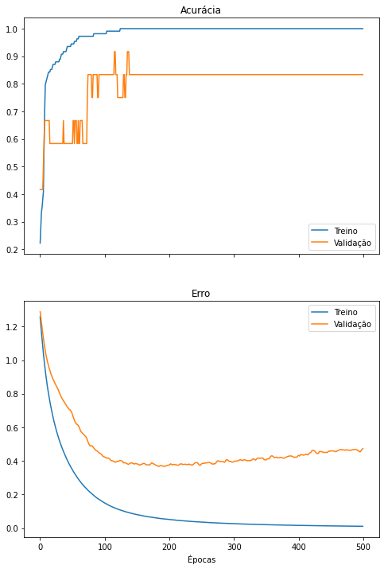
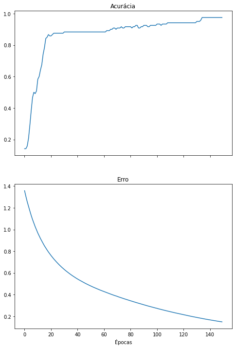
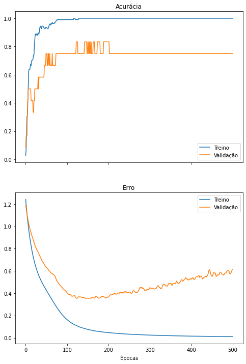
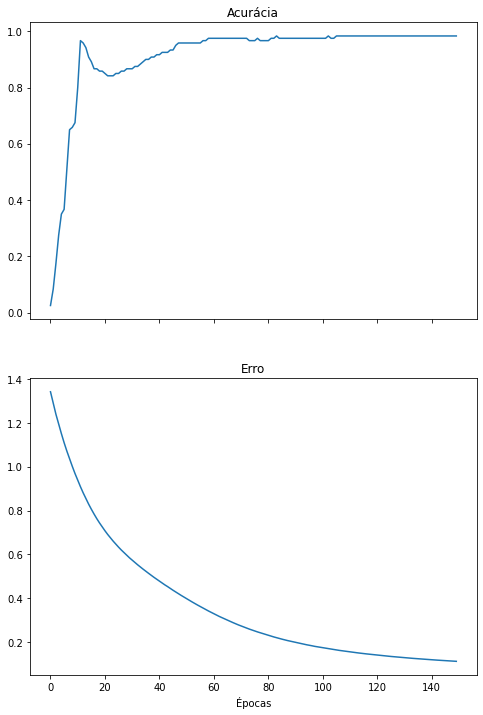
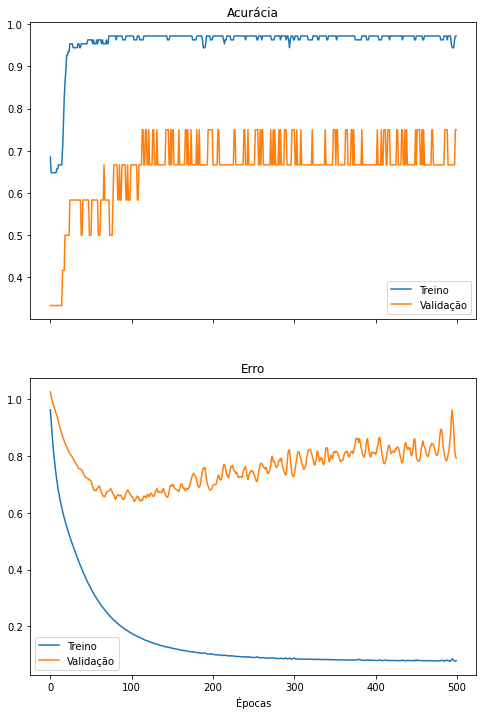
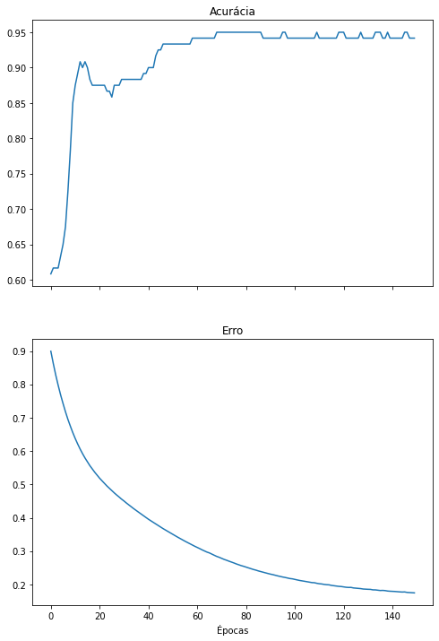

[](https://colab.research.google.com/drive/15vsVfH-qlJP2YBCdgS8V8uc8jjkRYCFs?usp=sharing)

Este notebook exemplifica a redução de dimensionalidades de uma base de dados e a posterior classificação de seus itens utilizando uma rede neural. A redução de dimensionalidades é executada utilizando [análise de componentes principais](https://pt.wikipedia.org/wiki/An%C3%A1lise_de_componentes_principais), disponível no pacote *scikit-learn* e a rede neural é um perceptron multi-camadas, construído utilizando Keras.

Este notebook é uma continuação de um outro no qual a base de dados utilizada (Iris) e o método de treinamento e avaliação da rede neural já foram descritos. O notebook anterior está disponível [aqui](https://colab.research.google.com/drive/13r1TY_BF1AXOMH8ufDEct3E8g243sONM#scrollTo=MLs97GxwgNrs).

# Importando pacotes e criando funções

Vamos utilizar scikit-learn e Keras. Também vamos criar algumas funções para simplificar o treinamento e avaliar de uma rede neural, que já foram descritos no notebook anterior.


```python
from sklearn.datasets import load_iris
from sklearn.model_selection import train_test_split
from sklearn.metrics import classification_report, confusion_matrix
from sklearn.decomposition import PCA

import matplotlib.pyplot as plt

import tensorflow.keras as keras
import numpy as np
from tensorflow.keras.models import Sequential
from tensorflow.keras.layers import Dense

def create_model(input_dim):
  model = Sequential()
  model.add(Dense(10, activation='tanh', input_dim=input_dim))
  model.add(Dense(8,activation='tanh'))
  model.add(Dense(6,activation='tanh'))
  model.add(Dense(3,activation='softmax'))
  model.compile('adam','categorical_crossentropy', metrics=['categorical_accuracy'])

  return model

def plot_metrics(history):
  fig, axes = plt.subplots(2,1, True,figsize=(8,12))

  #  "Accuracy"
  axes[0].plot(history.history['categorical_accuracy'])
  axes[0].set_title('Acurácia')
  # "Loss"
  axes[1].plot(history.history['loss'])
  axes[1].set_title('Erro')

  if 'val_loss' in history.history.keys():
    axes[0].plot(history.history['val_categorical_accuracy'])
    axes[1].plot(history.history['val_loss'])
    axes[0].legend(['Treino', 'Validação'])
    axes[1].legend(['Treino', 'Validação'])

  plt.xlabel('Épocas')

  plt.show()

def do_everything(X, y):
  X_train, X_test, y_train, y_test = train_test_split(X,
                                                    y,
                                                    test_size = 0.2,
                                                    random_state=123)
  
  y_train_onehot = keras.utils.to_categorical(y_train, num_classes = 3)
  y_test_onehot = keras.utils.to_categorical(y_test, num_classes = 3)

  model=create_model(X.shape[1])
  print(model.summary())

  history = model.fit(X_train, y_train_onehot, validation_split=.1, epochs=500, verbose=0)
  plot_metrics(history)

  model=create_model(X.shape[1])
  history = model.fit(X_train, y_train_onehot, epochs=150, verbose=0)
  plot_metrics(history)

  y_pred = model.predict(X_test)
  y_pred_onehot = y_pred.argmax(axis=1)

  print(classification_report(y_test, y_pred_onehot))
  print(confusion_matrix(y_test, y_pred_onehot))
```

# Análise de componentes principais

A análise de componentes principais (PCA, do inglês *principal component analysis*) é uma técnica matemática que detecta correlações nas colunas de uma matriz $X$ e realiza uma transformação linear em $X$ de forma a reduzir tais correlações.

Em linhas gerais, dados altamente correlacionadas são pouco informativos, inclusive para o treinamento de um classificador. Considere uma base de dados  hipotética de cidades que possui as seguintes informações para cada cidade:

1. distância do Equador em quilômetros
2. distância do Equador em léguas
3. temperatura em °C
4. temperatura em °F

É possível perceber que os dados 1 e 2 são redundantes, por armazenarem a mesma informação, apenas em escalas diferentes, assim como os dados 3 e 4. Não só isso, como a temperatura de uma cidade é altamente correlacionada com sua distância do Equador. Uma técnica como o PCA encontraria as correlações nesta matriz de 4 colunas e transformaria as colunas de forma a reduzir (ou zerar) tais correlações.

Esta transformação pode ter como efeito colateral a concentração da informação das colunas na matriz original em menos colunas na matriz transformada. Por consequência, seria possível **remover as colunas menos informativas**, reduzindo a complexidade dos dados, mas retendo a informação necessária para se treinar um classificador, por exemplo.

A redução de dimensionalidade de dados proveniente do PCA também é útil para fins de visualização de dados multidimensionais.

## Preparando os dados

Usaremos o pacote *scikit-learn* para carregar a base de dados Iris. Repare que ela possui 150 flores e 4 características por flor. No notebook anterior, utilizamos todas as 4 características para treinar nossa rede neural. Neste notebook, tentaremos realizar a mesma classificação com um menor número de características.


```python
iris_X, iris_y = load_iris(return_X_y=True)

print('Qtd. itens no conj. de treinamento:', len(iris_X))
print('Classes:', iris_y)

print('\nExemplos das medidas de 5 flores:')
print(iris_X[:5])
```

    Qtd. itens no conj. de treinamento: 150
    Classes: [0 0 0 0 0 0 0 0 0 0 0 0 0 0 0 0 0 0 0 0 0 0 0 0 0 0 0 0 0 0 0 0 0 0 0 0 0
     0 0 0 0 0 0 0 0 0 0 0 0 0 1 1 1 1 1 1 1 1 1 1 1 1 1 1 1 1 1 1 1 1 1 1 1 1
     1 1 1 1 1 1 1 1 1 1 1 1 1 1 1 1 1 1 1 1 1 1 1 1 1 1 2 2 2 2 2 2 2 2 2 2 2
     2 2 2 2 2 2 2 2 2 2 2 2 2 2 2 2 2 2 2 2 2 2 2 2 2 2 2 2 2 2 2 2 2 2 2 2 2
     2 2]
    
    Exemplos das medidas de 5 flores:
    [[5.1 3.5 1.4 0.2]
     [4.9 3.  1.4 0.2]
     [4.7 3.2 1.3 0.2]
     [4.6 3.1 1.5 0.2]
     [5.  3.6 1.4 0.2]]


# Aplicando o PCA na base de dados Iris

O PCA está implementado no *scikit-learn* e pode ser aplicado como no exemplo abaixo. Vamos criar uma função que aplica o PCA a um conjunto de dados, exibe informações de sua aplicação e retorna o conjuntos de dados transformados.


```python
def apply_PCA(X, n_components):
  pca = PCA(n_components=n_components)
  new_X = pca.fit_transform(iris_X)
  print('Tamanho da base de dados antes: ', X.shape)
  print('Tamanho da base de dados depois: ', new_X.shape)
  print('Porcentagem da variância explicada por cada coluna:', pca.explained_variance_ratio_)
  print('Variância acumulada nas colunas remanescentes:', sum(pca.explained_variance_ratio_))

  return new_X
```

Vamos aplicar o PCA nas medidas de nossas flores e observar a remoção da correlação das colunas e concentração das informações em menos colunas.


```python
iris_X_4cp = apply_PCA(iris_X, 4)
```

    Tamanho da base de dados antes:  (150, 4)
    Tamanho da base de dados depois:  (150, 4)
    Porcentagem da variância explicada por cada coluna: [0.92461872 0.05306648 0.01710261 0.00521218]
    Variância acumulada nas colunas remanescentes: 1.0


Perceba como nossa base dados ainda possui o mesmo número de características (4). Porém, 92% da informação das colunas originais (representada pela variância) está agora concentrada na primeira coluna. Isso é um forte indicativo de que podemos classificar nossos dados utilizando menos características.

O PCA costuma ordenar as colunas da nova base de dados em ordem decrescente de quantidade de informação, então, para garantir que estamos utilizando as colunas mais informativas de nossa base, basta ignorarmos as últimas colunas da matriz.

# Aplicando o PCA para 3 componentes

Agora vamos aplicar o PCA e remover a coluna menos informativa. Isso tem o mesmo efeito de utilizar as 3 primeiras colunas da matriz gerada anteriormente, mas vamos aplicar o método de novo de qualquer forma.

Repare como as colunas remanescentes ainda mantêm 99,4% da informação da base de dados original.


```python
iris_X_3cp = apply_PCA(iris_X, 3)
```

    Tamanho da base de dados antes:  (150, 4)
    Tamanho da base de dados depois:  (150, 3)
    Porcentagem da variância explicada por cada coluna: [0.92461872 0.05306648 0.01710261]
    Variância acumulada nas colunas remanescentes: 0.9947878161267247


Vamos utilizar nossas funções de treinamento e avaliação de redes neurais para treinar um modelo nos dados reduzidos.


```python
do_everything(iris_X_3cp, iris_y)
```

    Model: "sequential"
    _________________________________________________________________
    Layer (type)                 Output Shape              Param #   
    =================================================================
    dense (Dense)                (None, 10)                40        
    _________________________________________________________________
    dense_1 (Dense)              (None, 8)                 88        
    _________________________________________________________________
    dense_2 (Dense)              (None, 6)                 54        
    _________________________________________________________________
    dense_3 (Dense)              (None, 3)                 21        
    =================================================================
    Total params: 203
    Trainable params: 203
    Non-trainable params: 0
    _________________________________________________________________
    None








                  precision    recall  f1-score   support
    
               0       1.00      1.00      1.00        13
               1       1.00      1.00      1.00         6
               2       1.00      1.00      1.00        11
    
        accuracy                           1.00        30
       macro avg       1.00      1.00      1.00        30
    weighted avg       1.00      1.00      1.00        30
    
    [[13  0  0]
     [ 0  6  0]
     [ 0  0 11]]


É possível observar que a rede neural é treinada com sucesso utilizando apenas as 3 características mais informativas provenientes do PCA. A rede ainda alcança altos valores de precisão, revocação e F1-score. Também é possível perceber que, assim como no notebook anterior, o *overfitting* ainda ocorre caso treinemos a rede neural por épocas demais. Isso, o PCA não resolve.

# Aplicando o PCA para 2 componentes

Vamos reduzir nossa base de dados mais ainda, mantendo apenas 2 colunas.


```python
iris_X_2cp = apply_PCA(iris_X, 2)
```

    Tamanho da base de dados antes:  (150, 4)
    Tamanho da base de dados depois:  (150, 2)
    Porcentagem da variância explicada por cada coluna: [0.92461872 0.05306648]
    Variância acumulada nas colunas remanescentes: 0.977685206318795


Mesmo mantendo metade das colunas originais, ainda retemos 97,7% da informação de nossas flores. Vamos treinar nosso classificador usando esta nova base.


```python
do_everything(iris_X_2cp, iris_y)
```

    Model: "sequential_2"
    _________________________________________________________________
    Layer (type)                 Output Shape              Param #   
    =================================================================
    dense_8 (Dense)              (None, 10)                30        
    _________________________________________________________________
    dense_9 (Dense)              (None, 8)                 88        
    _________________________________________________________________
    dense_10 (Dense)             (None, 6)                 54        
    _________________________________________________________________
    dense_11 (Dense)             (None, 3)                 21        
    =================================================================
    Total params: 193
    Trainable params: 193
    Non-trainable params: 0
    _________________________________________________________________
    None








                  precision    recall  f1-score   support
    
               0       1.00      1.00      1.00        13
               1       0.83      0.83      0.83         6
               2       0.91      0.91      0.91        11
    
        accuracy                           0.93        30
       macro avg       0.91      0.91      0.91        30
    weighted avg       0.93      0.93      0.93        30
    
    [[13  0  0]
     [ 0  5  1]
     [ 0  1 10]]


Novamente, a rede neural ainda classifica os dados com sucesso, porém pode começar a demonstrar perda de desempenho, como demonstrado por valores de precisão, revocação e F1-score menores ou uma matriz de confusão com valores fora da diagonal principal.

Outra informação muito interessante de ser reparada é a redução no número de pesos treináveis da rede, exibido no resumo da rede neural no início da célula anterior (`Trainable params`). A rede neural treinada para classificar os dados originais (com 4 características) precisa aprender mais pesos (213) do que uma rede que classifica dados com menos características (2 características, 193 pesos). Isso significa que, ao utilizar o PCA, uma rede neural menor que processa menos dados pode potencialmente ter o mesmo desempenho que uma rede maior que processa mais dados.

# E, finalmente...

Vamos treinar a rede para classificar nossa flores **utilizando apenas 1 característica**. A base de dados mantém 92,4% da informação, a rede neural possui 10 pesos a menos e ainda alcança um desempenho satisfatório.


```python
iris_X_1cp = apply_PCA(iris_X, 1)
do_everything(iris_X_1cp, iris_y)
```

    Tamanho da base de dados antes:  (150, 4)
    Tamanho da base de dados depois:  (150, 1)
    Porcentagem da variância explicada por cada coluna: [0.92461872]
    Variância acumulada nas colunas remanescentes: 0.9246187232017271
    Model: "sequential_4"
    _________________________________________________________________
    Layer (type)                 Output Shape              Param #   
    =================================================================
    dense_16 (Dense)             (None, 10)                20        
    _________________________________________________________________
    dense_17 (Dense)             (None, 8)                 88        
    _________________________________________________________________
    dense_18 (Dense)             (None, 6)                 54        
    _________________________________________________________________
    dense_19 (Dense)             (None, 3)                 21        
    =================================================================
    Total params: 183
    Trainable params: 183
    Non-trainable params: 0
    _________________________________________________________________
    None








                  precision    recall  f1-score   support
    
               0       1.00      1.00      1.00        13
               1       0.67      1.00      0.80         6
               2       1.00      0.73      0.84        11
    
        accuracy                           0.90        30
       macro avg       0.89      0.91      0.88        30
    weighted avg       0.93      0.90      0.90        30
    
    [[13  0  0]
     [ 0  6  0]
     [ 0  3  8]]


# Conclusão

Este notebook explicou o PCA, uma técnica que transforma uma base de dados, representada por uma matriz, em uma nova matriz cujas colunas possuem menos correlação e maior concentração de informação em um menor número ce colunas.

O PCA foi exemplificado na base de dados Iris e redes neurais foram treinadas para classificar as flores utilizando cada vez menos características.
