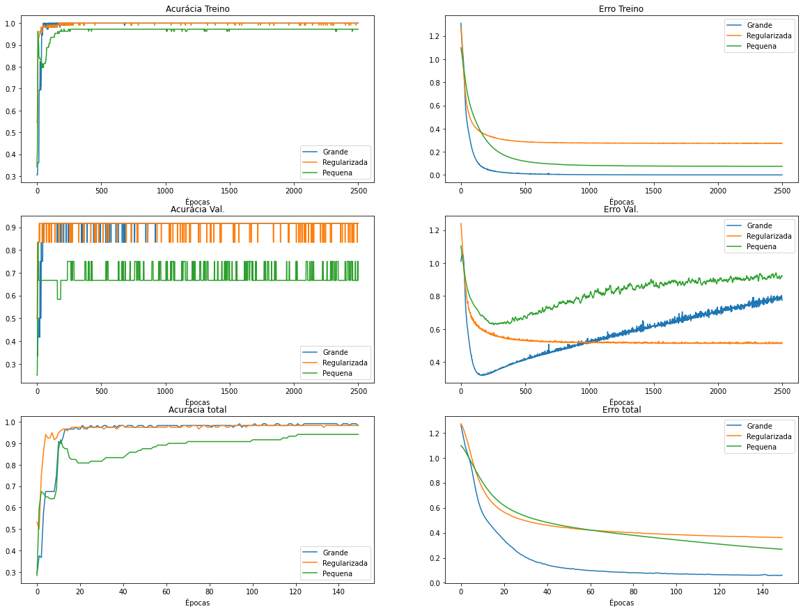

[](https://colab.research.google.com/drive/1kOaj4ogt13P0XlaoZ0wqezgEP9KCB8bf?usp=sharing)

Este notebook continua uma série na qual foram introduzidas a base de dados Iris e o método de treinamento e avaliação de redes neurais [[1]](https://colab.research.google.com/drive/13r1TY_BF1AXOMH8ufDEct3E8g243sONM#scrollTo=MLs97GxwgNrs) e o PCA [[2]](https://colab.research.google.com/drive/15vsVfH-qlJP2YBCdgS8V8uc8jjkRYCFs#scrollTo=LOpZfT9qCa3K).

No primeiro notebook, foram mencionadas duas coisas que serão testadas aqui.

1. redes neurais maiores (com mais pesos treináveis) possuem maior predisposição ao *overfitting*.
2. existe uma técnica, chamada *regularização*, capaz de combater o *overfitting*.

Neste notebook, uma rede consideravelmente menor será treinada para classificar a base de dados Iris. Não só isso, como ela usará a primeira componente principal retornada pelo PCA, trabalhando tanto com menos pesos como menos dados.

Além disso, treinaremos a rede neural original, utilizada nos notebooks anteriores, com regularização L2 e observaremos a ausência de *overfitting* quando a rede é treinada por longos períodos de tempo.

# Importando pacotes e criando funções

As funções abaixo aplicam o PCA numa base de dados e avaliam uma rede neural, retornando as medidas para serem exibidas em gráficos posteriormente.

```python
from sklearn.datasets import load_iris
from sklearn.model_selection import train_test_split
from sklearn.metrics import classification_report, confusion_matrix
from sklearn.decomposition import PCA

import matplotlib.pyplot as plt

import tensorflow.keras as keras
import numpy as np
from tensorflow.keras.models import Sequential
from tensorflow.keras.layers import Dense

def apply_PCA(X, n_components):
  pca = PCA(n_components=n_components)
  new_X = pca.fit_transform(iris_X)
  print('Tamanho da base de dados antes: ', X.shape)
  print('Tamanho da base de dados depois: ', new_X.shape)
  print('Porcentagem da variância explicada por cada coluna:', pca.explained_variance_ratio_)
  print('Variância acumulada nas colunas remanescentes:', sum(pca.explained_variance_ratio_))

  return new_X

def evaluate_model(model, X, y):
  X_train, X_test, y_train, y_test = train_test_split(X,
                                                    y,
                                                    test_size = 0.2,
                                                    random_state=123)
  
  y_train_onehot = keras.utils.to_categorical(y_train, num_classes = 3)
  y_test_onehot = keras.utils.to_categorical(y_test, num_classes = 3)

  model.save_weights('weights.hdf5')
  history = model.fit(X_train, y_train_onehot, validation_split=.1, epochs=2500, verbose=0)

  y_pred = model.predict(X_test)
  y_pred_onehot = y_pred.argmax(axis=1)
  print(classification_report(y_test, y_pred_onehot))
  
  v1 = history.history['categorical_accuracy']
  v2 = history.history['loss']
  v3 = history.history['val_categorical_accuracy']
  v4 = history.history['val_loss']

  model.load_weights('weights.hdf5')
  history = model.fit(X_train, y_train_onehot, epochs=150, verbose=0)
  
  v5 = history.history['categorical_accuracy']
  v6 = history.history['loss']
  
  y_pred = model.predict(X_test)
  y_pred_onehot = y_pred.argmax(axis=1)
  print(classification_report(y_test, y_pred_onehot))

  return v1, v2, v3, v4, v5, v6
```

## Preparando os dados

Usaremos o pacote *scikit-learn* para carregar a base de dados Iris. Vamos geraruma versão da base com o menor número possível de componentes principais (1).

```python
iris_X, iris_y = load_iris(return_X_y=True)
iris_X_tiny = apply_PCA(iris_X, 1)
```

    Tamanho da base de dados antes:  (150, 4)
    Tamanho da base de dados depois:  (150, 1)
    Porcentagem da variância explicada por cada coluna: [0.92461872]
    Variância acumulada nas colunas remanescentes: 0.9246187232017271

# Regularização

Em termos matemáticos, o *overfitting* ocorre quando os pesos de uma rede neural assumem magnitudes (positivas ou negativas) muito altas, permitindo que as funções que essas redes neurais modelam se tornem demasiadamente complexas para a função de erro que tentam minimizar.

Na imagem abaixo, ambas as funções azul e verde se ajustam aos dados vermelhos, porém a função azul assumiu uma forma desnecessariamente complexa. Caso um novo ponto vermelho seja adicionado, é possível que a função verde esteja mais próxima dele do que a função azul, indicando que a função verde generaliza melhor os dados observados, mesmo sendo mais simples.


A diferença entre as duas funções está no fato da função verde ter sido regularizada. Em sua forma mais simples, a regularização é feita somando-se os pesos da rede neural à função de erro que a rede tenta minimizar. Imaginando que $L(\theta)$ é a função de erro que usamos até agora, $R(\theta)$ é o novo termo de regularização que incluímos.

$$J(\theta)=L(\theta) + \lambda R(\theta)$$

Uma regularização comumente usada é a L2, na qual somamos o quadrado dos pesos da rede neural à função de erro. Isso tem o efeito de punir demasiadamente pesos muito grandes, ignorando pesos pequenos. O termo $\lambda$ é um coeficiente que indica o quão relevante o termo de regularização é na fórmula total do erro. Ele será utilizado na declaração da rede neural que faremos em Keras.

$$J(\theta)=L(\theta) + \lambda \sum_w^{\theta}w^2$$

Com a regularização, a rede neural deve alcançar o menor erro possível com os menores pesos possíveis, evitando o *overfitting*.

As funções abaixo vão criar as rede neurais.

1. A primeira foi utilizada nos tutoriais anterior e possui 4 entradas, 4 camadas e 213 pesos treináveis.
2. A segunda é igual à primeira, porém com a regularização configurada nas camadas.
3. A última rede possui aproximadamente 10% do tamanho da primeira, 1 entrada, 3 camadas e 23 pesos treináveis.

```python
def create_large_model(input_dim):
  model = Sequential()
  model.add(Dense(10, activation='tanh', input_dim=input_dim))
  model.add(Dense(8,activation='tanh'))
  model.add(Dense(6,activation='tanh'))
  model.add(Dense(3,activation='softmax'))
  model.compile('adam','categorical_crossentropy', metrics=['categorical_accuracy'])

  return model

def create_regularized_model(input_dim):
  model = Sequential()
  model.add(Dense(10, activation='tanh', kernel_regularizer='l2', bias_regularizer='l2', input_dim=input_dim))
  model.add(Dense(8,activation='tanh',  kernel_regularizer='l2', bias_regularizer='l2'))
  model.add(Dense(6,activation='tanh',  kernel_regularizer='l2', bias_regularizer='l2'))
  model.add(Dense(3,activation='softmax',  kernel_regularizer='l2', bias_regularizer='l2'))
  model.compile('adam','categorical_crossentropy', metrics=['categorical_accuracy'])

  return model

def create_tiny_model(input_dim):
  model = Sequential()
  model.add(Dense(3, activation='tanh', input_dim=input_dim))
  model.add(Dense(2,activation='tanh'))
  model.add(Dense(3,activation='softmax'))
  model.compile('adam','categorical_crossentropy', metrics=['categorical_accuracy'])

  return model

large_net = create_large_model(iris_X.shape[1])
reg_net = create_regularized_model(iris_X.shape[1])
tiny_net = create_tiny_model(iris_X_tiny.shape[1])

large_net.summary()
tiny_net.summary()
```

    Model: "sequential"
    _________________________________________________________________
    Layer (type)                 Output Shape              Param #   
    =================================================================
    dense (Dense)                (None, 10)                50        
    _________________________________________________________________
    dense_1 (Dense)              (None, 8)                 88        
    _________________________________________________________________
    dense_2 (Dense)              (None, 6)                 54        
    _________________________________________________________________
    dense_3 (Dense)              (None, 3)                 21        
    =================================================================
    Total params: 213
    Trainable params: 213
    Non-trainable params: 0
    _________________________________________________________________
    Model: "sequential_2"
    _________________________________________________________________
    Layer (type)                 Output Shape              Param #   
    =================================================================
    dense_8 (Dense)              (None, 3)                 6         
    _________________________________________________________________
    dense_9 (Dense)              (None, 2)                 8         
    _________________________________________________________________
    dense_10 (Dense)             (None, 3)                 9         
    =================================================================
    Total params: 23
    Trainable params: 23
    Non-trainable params: 0
    _________________________________________________________________

Vamos utilizar nossa função `evaluate_model()` para avaliar as redes. As redes maiorws serão treinadas na base original e a rede menor, na 1ª componente principal dessa base.

```python
acc1_large, l1_large, acc_v_large, lv_large, acc2_large, l2_large = evaluate_model(large_net, iris_X, iris_y)
acc1_reg, l1_reg, acc_v_reg, lv_reg, acc2_reg, l2_reg = evaluate_model(reg_net, iris_X, iris_y)
acc1_tiny, l1_tiny, acc_v_tiny, lv_tiny, acc2_tiny, l2_tiny = evaluate_model(tiny_net, iris_X_tiny, iris_y)
```

                  precision    recall  f1-score   support
    
               0       1.00      1.00      1.00        13
               1       0.75      1.00      0.86         6
               2       1.00      0.82      0.90        11
    
        accuracy                           0.93        30
       macro avg       0.92      0.94      0.92        30
    weighted avg       0.95      0.93      0.93        30
    
                  precision    recall  f1-score   support
    
               0       1.00      1.00      1.00        13
               1       1.00      0.83      0.91         6
               2       0.92      1.00      0.96        11
    
        accuracy                           0.97        30
       macro avg       0.97      0.94      0.96        30
    weighted avg       0.97      0.97      0.97        30
    
                  precision    recall  f1-score   support
    
               0       1.00      1.00      1.00        13
               1       1.00      0.83      0.91         6
               2       0.92      1.00      0.96        11
    
        accuracy                           0.97        30
       macro avg       0.97      0.94      0.96        30
    weighted avg       0.97      0.97      0.97        30
    
                  precision    recall  f1-score   support
    
               0       1.00      1.00      1.00        13
               1       1.00      0.83      0.91         6
               2       0.92      1.00      0.96        11
    
        accuracy                           0.97        30
       macro avg       0.97      0.94      0.96        30
    weighted avg       0.97      0.97      0.97        30
    
                  precision    recall  f1-score   support
    
               0       1.00      1.00      1.00        13
               1       0.67      1.00      0.80         6
               2       1.00      0.73      0.84        11
    
        accuracy                           0.90        30
       macro avg       0.89      0.91      0.88        30
    weighted avg       0.93      0.90      0.90        30
    
                  precision    recall  f1-score   support
    
               0       1.00      1.00      1.00        13
               1       0.83      0.83      0.83         6
               2       0.91      0.91      0.91        11
    
        accuracy                           0.93        30
       macro avg       0.91      0.91      0.91        30
    weighted avg       0.93      0.93      0.93        30

São exibidos os valores para cada rede treinada na base de treinamento por 2500 épocas e depois por 150 eṕocas. Espera-se que o desempenho das redes neurais que sofram de *overfitting* seja inferior nos valores impresso primeiro.

Os valores podem mudar aleatoriamente, porém é possível perceber através dos valores de precisão, recall, F1-score e pela matriz de confusão que o desempenho de ambas as redes é comparável e, muitas vezes, idêntico.

Vamos gerar gráficos das 6 medidas coletadas dos dois modelos.

```python
fig, axes = plt.subplots(3,2, False,figsize=(20, 15), squeeze=True)

axes[0][0].plot(acc1_large)
axes[0][0].plot(acc1_reg)
axes[0][0].plot(acc1_tiny)
axes[0][0].set_title('Acurácia Treino')

axes[0][1].plot(l1_large)
axes[0][1].plot(l1_reg)
axes[0][1].plot(l1_tiny)
axes[0][1].set_title('Erro Treino')

axes[1][0].plot(acc_v_large)
axes[1][0].plot(acc_v_reg)
axes[1][0].plot(acc_v_tiny)
axes[1][0].set_title('Acurácia Val.')

axes[1][1].plot(lv_large)
axes[1][1].plot(lv_reg)
axes[1][1].plot(lv_tiny)
axes[1][1].set_title('Erro Val.')

axes[2][0].plot(acc2_large)
axes[2][0].plot(acc2_reg)
axes[2][0].plot(acc2_tiny)
axes[2][0].set_title('Acurácia total')

axes[2][1].plot(l2_large)
axes[2][1].plot(l2_reg)
axes[2][1].plot(l2_tiny)
axes[2][1].set_title('Erro total')

legenda = ['Grande', 'Regularizada', 'Pequena']
xlabel = 'Épocas'

axes[0][0].legend(legenda)
axes[1][0].legend(legenda)
axes[2][0].legend(legenda)
axes[0][1].legend(legenda)
axes[1][1].legend(legenda)
axes[2][1].legend(legenda)
axes[0][0].set_xlabel(xlabel)
axes[1][0].set_xlabel(xlabel)
axes[2][0].set_xlabel(xlabel)
axes[0][1].set_xlabel(xlabel)
axes[1][1].set_xlabel(xlabel)
axes[2][1].set_xlabel(xlabel)

plt.show()
```



Ambas as redes foram treinadas por 2500 épocas e avaliadas no conjunto de validação para constatar a presença de *overfitting* (4 primeiros gráficos). Depois, foram treinadas novamente por 150 épocas na totalidade dos dados de treinamento (2 últimos gráficos).

O gráfico de erro no conjunto de treinamento (topo, direita) nos mostra que a rede menor leva mais épocas para aprender. Seu erro diminui lentamente. A rede regularizada não consegue diminuir seu erro tanto quanto as redes não regularizadas devido à restrição em seus pesos. Isso pode parecer ruim, mas veremos um efeito positivo da regularização a seguir.

O gráfico de erro no conjunto de validação (centro, direita) demonstra que o erro da rede grande não-regularizada começa a crescer linearmente após aproximadamente 200 épocas. Um período de treinamento muito extenso apenas prejudica esta rede. A rede menor, apesar de ser menos afetada pelo *overfitting*, ainda demonstra aumenta do erro após muitas épocas de treinamento. Porém, este aumento é mais lento que na rede neural grande. Por último, a rede grande regularizada não demonstra aumento do erro no conjunto de validação, independente da quantidade de épocas de treinamento.

Essa é uma característica interessante no mundo real, quando não sabemos exatamente a topologia exata da rede neural que solucionará nosso problema em questão, ou por quantas épocas de treinamento é necessário treinar o modelo.

# Conclusão

Este notebook demonstrou que uma rede neural consideravelmente menor que a utilizada até o momento é capaz de realizar a classificação das flores na base de dados Iris, utilizando 1/4 dos valores de entrada, 3/4 do número de camadas e aproximadamente 1/10 dos pesos treináveis.
